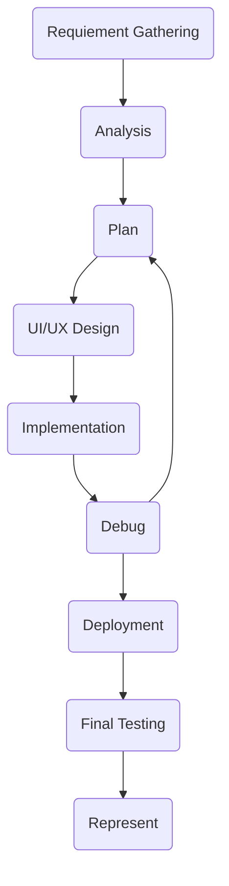

# Online Bus Monitoring & Management system
Students often face difficulties because they do not know the exact location or arrival time of their university bus, which leads to delays, long waiting times, and missed buses. At the same time, managing student fees manually creates errors, confusion, and extra workload for the administration. No combined system can track buses in real time and manage student fee records accurately.

## Objectives
1) To provide real-time tracking of university buses.
2) To reduce waiting time and prevent students from missing
3) To improve the safety and monitoring of students during 
travel

## Methodology


## Technologies
Following technologies are used in the development of this project
#### Integrated Development Environments (IDE)
- Visual Studio Code
- Android Studio
#### Version Control
- Git/GitHub
#### Frontend Tools
- ReactJS
- ViteJS
- Tailwind CSS
- JavaScript
#### Backend Tools
- Fast-API
- MySQL
#### Mobile Tools
- React Native
- TypeScript

## Requirements
Here are the following requirements need to be installed to run this project
- NodeJS LTS
- Python 3
- Git Bash
- MySQL
- Microsoft open JDK 17
- Android Studio
  - Android 16 ('Baklava')
    - Android SDK Platform 36
    - Sources for Android 36
- Android Device (minimum Android 11)

## Run Development Environment
These points will help you run the project only in the development environment. Please contact developers for production environment.
Download the project from the GitHub using the following command:
> git clone https://github.com/moeezraza35/OBMMS.git

After downloading the project see the project's apps' `README` files for further installation. You should follow this order.
- **Backend**: ```cd backend```
- **Frontend**: ```cd frontend```
- **Mobile**: ```cd mobile/Riphah_bus```

## Challenges
- Cross Origin Resource Sharing (CORS)
- Permission Model
- Redirecting
- Maps Integration
- Location Sharing

## Timeline
- 24 Nov 2025 - Requirement gathering
- 10 Dec 2025 - Analysis
- 16 Dec 2025 - Main page UI design
- 31 Dec 2025 - Drafted an Auth app
- 12 Jan 2026 - Drafted an Admin app
- 13 Jan 2026 - Fixed Login Exception
- 14 Jan 2026 - Fixed Permission Exceptions
- 19 Jan 2026 - Drafted a Tracking app
- 23 Jan 2026 - Improved redirecting
- 26 Jan 2026 - Add Bus management
- 30 Jan 2026 - Reduced code repeatation
- 01 Feb 2026 - Developed Stop Management
- 14 Feb 2026 - Edit Stop Errors Fixed
- 16 Feb 2026 - Drafted an Accounts app
- 19 Feb 2026 - Admin dashboard UI designed
- 21 Feb 2026 - Refactor & Implicit permissions
- 22 Feb 2026 - Developed all Admin REST APIs
- 25 Feb 2026 - Structure the Mobile App
- 26 Feb 2026 - Added a map view
- 28 Feb 2026 - Mobile App Authentication
- 02 Mar 2026 - Permissions by Packages
- 04 Mar 2026 - Added WebSockets
- 05 Mar 2026 - Added Location Handling
- 06 Mar 2026 - Realtime Location Handling
- 09 Mar 2026 - Location Sharing
- 31 Mar 2026 - Improve WebSocket Disconnection

## Refrences
- https://vite.dev/guide/
- https://www.w3schools.com/react/
- https://reactrouter.com/home
- https://tailwindcss.com/docs/installation/using-vite
- https://www.geeksforgeeks.org/python/fastapi-introduction/
- https://www.tutorialspoint.com/fastapi/fastapi_uvicorn.htm
- https://www.tutorialspoint.com/sqlalchemy/
- https://docs.sqlalchemy.org/en/20/orm/quickstart.html
- https://planetscale.com/blog/using-mysql-with-sql-alchemy-hands-on-examples
- https://www.tutorialspoint.com/sqlalchemy/
- https://www.svgrepo.com/
- https://www.tutorialspoint.com/fastapi/fastapi_static_files.htm
- https://stackoverflow.com/questions/287871/how-do-i-print-colored-text-to-the-terminal#:~:text=termcolor.COLORS%20gives%20you%20a,other%20platforms%2C%20Colorama%20does%20nothing
- https://pyjwt.readthedocs.io/en/stable/
- https://react-leaflet.js.org
- https://www.openstreetmap.org
- https://www.w3schools.com/tags/ref_httpmessages.asp
- https://medium.com/@farhanahmedindia/complete-guide-deploying-a-flask-app-on-apache-ubuntu-c2f5d7b17e20
- https://reactnative.dev/docs/set-up-your-environment
- https://reactnative.dev/docs/navigation
- https://reactnative.dev/docs/network
- https://www.npmjs.com/package/react-native-webview
- https://www.npmjs.com/package/react-native-keychain
- https://fastapi.tiangolo.com/advanced/websockets/
- https://archive.reactnative.dev/docs/geolocation#:~:text=iOS,result%20in%20a%20hard%20crash.